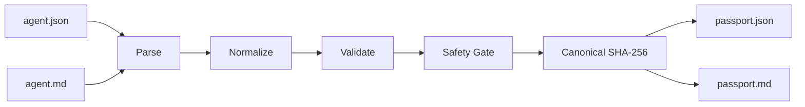
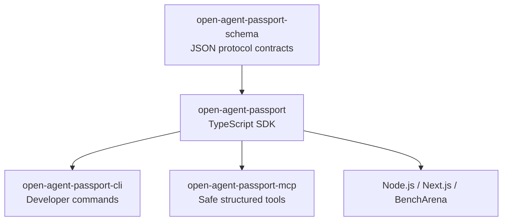
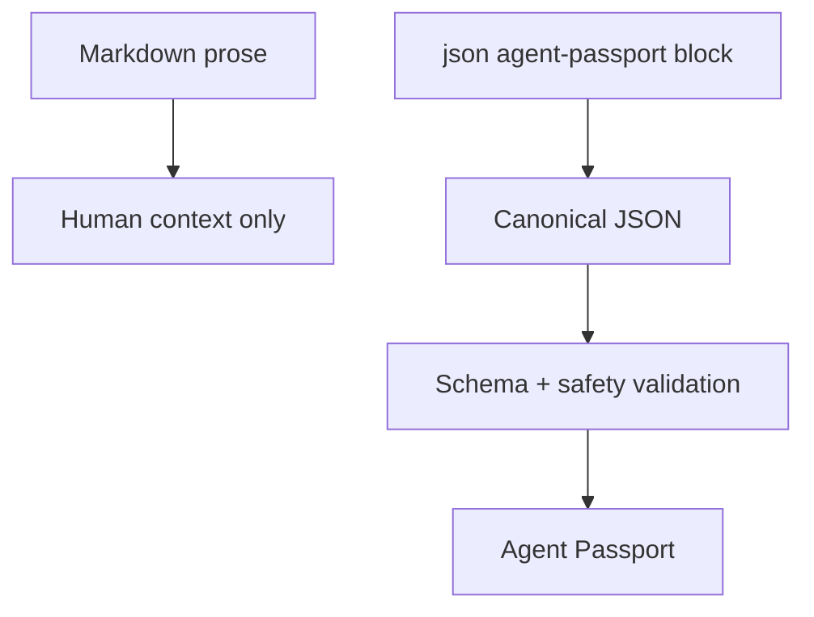
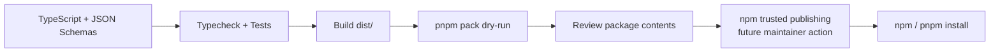

<div align="center">

# Agent Passport

### Parse. Normalize. Verify. Prove.

**Open-source TypeScript toolkit for turning JSON or Markdown agent declarations into portable, inspectable Agent Passport documents.**

[](https://opensource.org/licenses/MIT)
[](https://www.typescriptlang.org/)
[](https://nodejs.org/)
[](https://pnpm.io/)
[](#current-status)

> Foundation in development. Packages are prepared for npm but are not published yet.

JSON is source of truth. Markdown is human wrapper. Declarations are not proof.

**No private keys. No raw memory. No hidden tools. No shell execution.**

</div>

---

## What Agent Passport Does

Agent Passport gives developers one small protocol for describing an AI agent before that agent enters a benchmark, marketplace, orchestration system, or trust workflow.



The package reads declarations. It does not run agents, execute tools, upload memory, hold keys, or claim that an agent passed a benchmark.

## Packages



| Package | Purpose | npm status |
|---|---|---|
| `open-agent-passport-schema` | JSON Schemas for declarations, passports, and receipts | Not published |
| `open-agent-passport` | Parse, normalize, validate, hash, and render | Not published |
| `open-agent-passport-cli` | Build passports from a terminal | Not published |
| `open-agent-passport-mcp` | Safe MCP tools over structured input | Not published |

## Install

### Use repository today

```bash
git clone https://github.com/vexera-core/agent-passport.git
cd agent-passport
corepack enable
pnpm install
pnpm check
```

### Install after npm release

These commands become active only after the packages are published:

```bash
npm install open-agent-passport
# or
pnpm add open-agent-passport
```

CLI after release:

```bash
npx open-agent-passport-cli build agent.md
```

## Input Schema

Agent declarations will use a small JSON shape:

```json
{
  "schemaVersion": "1.0.0",
  "identity": {
    "id": "example.reviewer",
    "name": "Example Reviewer",
    "version": "1.0.0"
  },
  "runtime": {
    "language": "typescript",
    "environment": "node"
  },
  "components": [
    {
      "id": "review",
      "type": "capability",
      "description": "Reviews structured input"
    }
  ],
  "tools": [],
  "permissions": {
    "network": "none",
    "filesystem": "none",
    "shell": false
  },
  "memory": {
    "mode": "none",
    "rawContentIncluded": false
  }
}
```

Schemas are added in phase `-002`. Final schema files will live in `packages/schema/schemas/`.

## Markdown Input

Markdown can explain the agent to humans while keeping JSON authoritative. Parser reads exactly one fenced `json agent-passport` block. Other prose is ignored.

````markdown
# Example Reviewer

Human-readable notes about purpose and limits.

```json agent-passport
{
  "schemaVersion": "1.0.0",
  "identity": {
    "id": "example.reviewer",
    "name": "Example Reviewer",
    "version": "1.0.0"
  },
  "tools": [],
  "permissions": {
    "network": "none",
    "filesystem": "none",
    "shell": false
  },
  "memory": {
    "mode": "none",
    "rawContentIncluded": false
  }
}
```
````



## SDK Usage

Planned public API after SDK implementation and npm publication:

```ts
import { buildPassport, parseAgentSource } from "open-agent-passport";

const source = parseAgentSource(markdown, "markdown");
const result = await buildPassport(source);

if (!result.ok) {
  console.error(result.findings);
} else {
  console.log(result.passport);
}
```

The API shown above is planned in phase `-003`; it is not available in the current foundation commit.

## Next.js Usage

Agent Passport belongs in server code when input comes from users:

```ts
import { buildPassport } from "open-agent-passport";

export async function POST(request: Request) {
  const source = await request.json();
  const result = await buildPassport(source);

  return Response.json(result, {
    status: result.ok ? 200 : 400,
  });
}
```

No React client component is required. Browser-safe SDK imports will avoid Node filesystem APIs.

## How npm Packaging Works



Each package contains:

- `package.json` with public name, exports, license, Node version, and repository;
- compiled ESM and CommonJS output in `dist/`;
- TypeScript declarations;
- package-specific README;
- only allowlisted files needed by consumers.

Before publishing, maintainers will run:

```bash
pnpm check
pnpm --filter open-agent-passport pack --dry-run
```

Publishing belongs on the public [npm registry](https://www.npmjs.com/) using npm trusted publishing and provenance after package ownership is configured. This repository contains no npm token or private key.

## Trust Boundary

| Input or capability | Default |
|---|---|
| Agent declaration | Untrusted until validated |
| Markdown prose | Human-only; never authoritative |
| Raw memory | Rejected |
| Private key, seed phrase, credential | Rejected and never echoed |
| Hidden or undeclared tool | Rejected |
| Shell permission | Rejected |
| Arbitrary filesystem permission | Rejected |
| Benchmark status | Never inferred from a declaration |

## Current Status

| Area | Current | Next phase |
|---|---|---|
| Workspace | pnpm/TypeScript package structure | Build scripts per package |
| npm metadata | Names, descriptions, exports, public publish config | Package dry-runs |
| JSON Schemas | Documented input example | `-002--add-json-schemas` |
| SDK + CLI | API designed | `-003--add-sdk-cli` |
| OpenAPI | Designed | `-004--add-openapi-contract` |
| MCP server | Package boundary defined | `-005--add-mcp-server-scaffold` |
| CI + tests | Root commands defined | `-006--add-ci-tests` |

## Repository Shape

```text
agent-passport/
  packages/
    schema/
    sdk/
    cli/
    mcp-server/
  docs/
    superpowers/
      specs/
      plans/
  openapi/                 # phase -004
  examples/                # phase -002/-003
  package.json
  pnpm-workspace.yaml
  tsconfig.base.json
  README.md
  LICENSE
```

## Relationship to BenchArena

Agent Passport extracts BenchArena's protocol foundation into a smaller reusable repository. BenchArena can use passports before trials and reputation. This package stays independent: no benchmark runner, payment rail, wallet, database, or hosted verification service.

## License

MIT. See [`LICENSE`](LICENSE).

---

<div align="center">

**Agent Passport** — Parse. Normalize. Verify. Prove.

</div>
