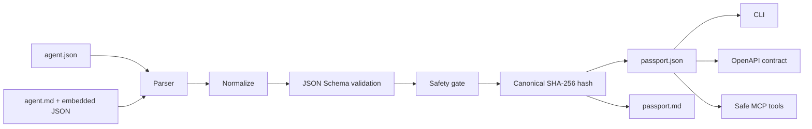

# Agent Passport Foundation Design

## Goal

Create a small, open-source protocol foundation extracted from BenchArena's passport layer. Developers can convert structured agent declarations into deterministic, inspectable Agent Passport documents without using a hosted service, private keys, raw memory, shell execution, or unrestricted filesystem access.

The foundation is independently useful in Node.js and Next.js projects. BenchArena may consume it later as a dependency; this repository does not depend on BenchArena.

## Principles

- JSON is the canonical source of truth.
- Markdown is a human wrapper around one canonical JSON block.
- Declarations are not benchmark proof.
- Validation and normalization are deterministic pure operations.
- Safety checks reject dangerous declarations; they do not execute agent tools.
- Current capabilities and future integrations are labeled honestly.
- Packages are public, unscoped, MIT-licensed, and publication-ready.

## Architecture



Dependency direction stays inward:

```text
schema <- sdk <- cli
              <- mcp-server
              <- OpenAPI adapter contract
```

## Workspace and Packages

The pnpm workspace targets Node.js 20 or newer and TypeScript ESM. Published packages provide TypeScript declarations and compatible ESM/CommonJS entry points where practical.

| Workspace | Published name | Responsibility |
|---|---|---|
| `packages/schema` | `open-agent-passport-schema` | JSON Schemas and safe examples |
| `packages/sdk` | `open-agent-passport` | Pure parsing, normalization, validation, safety checks, hashing, and rendering |
| `packages/cli` | `open-agent-passport-cli` | `init`, `validate`, `build`, `hash`, and `render` commands |
| `packages/mcp-server` | `open-agent-passport-mcp` | Stdio MCP tools over structured documents only |

Additional repository surfaces:

- `openapi/openapi.json`: contract for parse, validate, and build operations; no hosted API claim.
- `.github/actions/agent-passport`: composable validation action.
- `.github/workflows/ci.yml`: Node.js 20, 22, and 24 verification.
- `examples/`: valid JSON, Markdown, Node.js, and Next.js usage.

## Protocol Documents

### Agent Source

`agent-source.schema.json` represents untrusted declarations:

- stable identity and display metadata;
- runtime assumptions;
- declared components and capabilities;
- declared tools;
- permission boundaries;
- memory policy;
- source/provenance metadata.

### Agent Passport

`agent-passport.schema.json` represents normalized output:

- protocol and schema versions;
- normalized source fields;
- validation state;
- safety findings and eligibility;
- canonical source and passport hashes;
- deterministic generation metadata.

Passport status distinguishes `declared`, `validated`, and `blocked`. No local validation state means benchmarked, verified performance, or public reputation.

### Verification Receipt

`verification-receipt.schema.json` records local processing evidence:

- canonical input hash;
- passport hash;
- validator name/version;
- validation result and findings;
- receipt timestamp supplied through an explicit clock dependency.

Receipts are unsigned local evidence. V1 accepts no private key and makes no cryptographic identity claim beyond deterministic content hashes.

## Markdown Wrapper

Markdown input must contain exactly one fenced block labeled `json agent-passport`:

````markdown
# Example Agent

Human explanation is non-authoritative.

```json agent-passport
{
  "schemaVersion": "1.0.0"
}
```
````

Only JSON inside that block is parsed. Surrounding prose is ignored by protocol logic. Rendering regenerates the wrapper from canonical JSON plus safe summary fields.

## Processing Flow

1. Detect JSON or Markdown input explicitly; no heuristic code execution.
2. Extract and parse canonical JSON.
3. Validate source shape against JSON Schema.
4. Normalize ordering, optional defaults, identifiers, and enumerations.
5. Run safety policy checks.
6. Canonicalize JSON with stable key ordering and UTF-8 encoding.
7. Compute SHA-256 source and passport hashes.
8. Emit `passport.json`, optional `passport.md`, and local receipt.

The SDK exposes data/string APIs. Filesystem reads and writes exist only in the CLI adapter and remain limited to user-supplied input/output paths. Browser-safe and Next.js-compatible SDK imports contain no filesystem dependency.

## Safety Gate

V1 rejects:

- raw memory payloads or memory dumps;
- fields that contain private keys, seed phrases, secrets, or credentials;
- hidden or undeclared tools;
- shell/command execution permissions;
- unrestricted or arbitrary filesystem access;
- unknown high-risk permissions.

Findings contain stable codes, severity, JSON Pointer path, and remediation text. Sensitive rejected values are never echoed in errors, receipts, or Markdown output.

## CLI

```text
open-agent-passport init [path]
open-agent-passport validate <input>
open-agent-passport build <input> [--out <path>] [--markdown <path>]
open-agent-passport hash <input>
open-agent-passport render <passport.json> [--out <path>]
```

Human-readable output is default. `--json` returns machine-readable results. Exit codes are stable: success, validation failure, safety rejection, input error, and internal error.

## MCP Server

The stdio MCP server exposes narrow tools:

- `passport_validate`
- `passport_build`
- `passport_hash`
- `passport_render_markdown`

Tools accept structured JSON or Markdown text and return structured results. They cannot execute shell commands, inspect arbitrary files, use network services, accept private keys, upload memory, or invoke live agents.

## OpenAPI Contract

OpenAPI 3.1 describes equivalent stateless operations:

- `POST /v1/passports/validate`
- `POST /v1/passports/build`
- `POST /v1/passports/render`

The contract is adapter-ready documentation, not a claim that a server is hosted. Schemas reference repository JSON Schema definitions where OpenAPI tooling permits and duplicate only required transport envelopes.

## Distribution

Primary distribution target is the public npm registry:

```bash
npm install open-agent-passport
pnpm add open-agent-passport
npx open-agent-passport-cli build agent.md
```

Packages include `files` allowlists, `exports`, engine constraints, licenses, repository metadata, and `publishConfig`. CI runs package dry-runs. A future trusted-publishing workflow may publish with npm provenance after repository ownership and npm authority are configured. V1 does not publish automatically and docs never present unpublished versions as live.

The existing Git repository and configured `origin` remain authoritative. Setup instructions must not tell contributors to run `git init` or add a placeholder remote such as `git://git-remote-url`.

### npm Package Identity

Main SDK metadata:

```json
{
  "name": "open-agent-passport",
  "description": "Open-source TypeScript toolkit for parsing, normalizing, validating, hashing, and rendering portable AI agent passports from JSON or Markdown.",
  "license": "MIT",
  "keywords": [
    "ai-agent",
    "agent-passport",
    "agent-identity",
    "json-schema",
    "mcp",
    "typescript"
  ]
}
```

Companion descriptions:

- `open-agent-passport-schema`: Portable JSON Schemas for agent declarations, passports, and local verification receipts.
- `open-agent-passport-cli`: CLI for validating JSON or Markdown agent declarations and building deterministic Agent Passport documents.
- `open-agent-passport-mcp`: Safe MCP server for validating, building, hashing, and rendering Agent Passport documents without shell or arbitrary filesystem access.

Every published package receives its own npm-facing README, not a repository placeholder. Package READMEs include install, minimal working example, API/command surface, runtime compatibility, security boundaries, package links, license, and current publication status.

## README

Root README doubles as the npm landing page for `open-agent-passport`. It follows BenchArena's information style without copying unsupported product claims:

- centered title, tagline, factual badges, and development status;
- one-sentence npm description matching `package.json`;
- immediate `npm install open-agent-passport` and `pnpm add open-agent-passport` commands;
- a minimal copy-paste TypeScript example before architecture detail;
- architecture snapshot and protocol-loop Mermaid visuals;
- current versus planned table;
- install instructions for npm, pnpm, local workspace, Node.js, and Next.js;
- JSON and Markdown examples;
- trust boundary and safety policy;
- SDK, CLI, MCP, and OpenAPI examples;
- package/repository map;
- npm publishing guidance for maintainers.

Badges must describe repository facts. CI badge may point to this repository workflow. npm version badges remain absent until packages are actually published.

README order is optimized for npm users:

1. Package name, tagline, description, factual badges.
2. Install.
3. Five-minute JSON and Markdown usage.
4. Node.js and Next.js examples.
5. What a passport contains and how processing works.
6. SDK API, CLI, MCP, and OpenAPI surfaces.
7. Safety model and limitations.
8. Package map, contributing, publishing, and license.

README never includes generic npm scaffolding instructions such as `npm init` or placeholder repository URLs. Maintainer publishing guidance uses package dry-runs first and clearly separates build readiness from an actual npm release.

## Errors

All public errors use stable codes and avoid raw sensitive values. SDK functions return typed results for expected validation failures and throw only for programmer/internal faults. CLI and MCP adapters map shared errors without changing meaning.

## Testing and Quality

Tests cover:

- JSON and Markdown input parity;
- missing, duplicate, or malformed Markdown blocks;
- JSON Schema fixtures;
- deterministic normalization and hashing;
- every safety rejection class and redacted error output;
- SDK behavior in Node.js and browser-like builds;
- CLI commands, JSON output, and exit codes;
- OpenAPI structural validation;
- MCP tool schemas and forbidden capability boundaries;
- package tarball contents and consumer smoke tests;
- README code examples where practical.

CI runs install, formatting/lint checks, typecheck, unit/integration tests, build, package dry-runs, and smoke tests on Node.js 20, 22, and 24.

## Operational Scope

V1 is a local protocol toolkit, not a deployed backend. Tenancy, database capacity, network QPS, uptime SLO, RPO, and RTO do not apply. Pure validation/build operations target p95 below 100 ms for documents up to the documented size limit on a typical development machine. Hosted reliability targets require a separate adapter design.

## Commit Plan

1. `foundation--add-package-workspace`
2. `foundation--add-json-schemas`
3. `foundation--add-sdk-cli`
4. `foundation--add-openapi-contract`
5. `foundation--add-mcp-server-scaffold`
6. `foundation--add-ci-tests`

The first commit includes existing staged repository setup files. User changes are preserved. No live integration, publication, push, or release occurs in this task.

## Success Criteria

- Fresh clone installs and builds with documented Node.js/pnpm versions.
- JSON and Markdown inputs produce equivalent canonical passports.
- Hashes are deterministic across repeated runs.
- Unsafe declarations fail closed without leaking sensitive input.
- Node.js and Next.js examples compile against package exports.
- CLI works from packed local artifacts.
- MCP tools expose no execution, arbitrary filesystem, memory-upload, secret, or live-network capability.
- OpenAPI and JSON Schemas validate in CI.
- README distinguishes implemented, planned, and future work.
